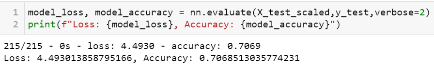
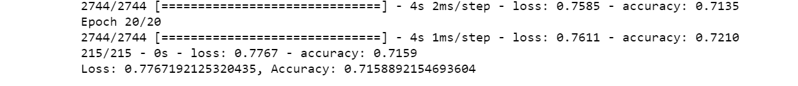
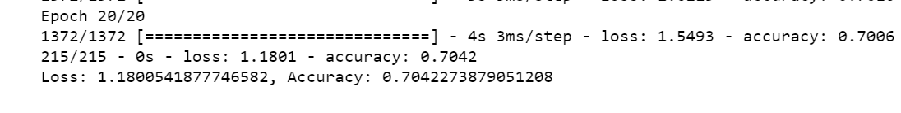

# Neural_Network_Charity_Analysis
## Overview of the analysis

 ### PURPOSE -
 To predict where to make investments.
 With  knowledge of machine learning and neural networks,  using the features in the  dataset  a binary classifier that is capable of predicting whether applicants will be successful if funded by Alphabet Soup is created
 
### Results: 

### Data Preprocessing
- What variable(s) are considered the target(s) for your model?
##### The IS_SUCCESSFUL variable was theTarget
- 
- What variable(s) are considered to be the features for your model?
##### 'APPLICATION_TYPE', 'AFFILIATION', 'CLASSIFICATION', 'USE_CASE''ORGANIZATION', 'STATUS', 'INCOME_AMT', 'SPECIAL_CONSIDERATIONS','ASK_AMT' were the features

- What variable(s) are neither targets nor features, and should be removed from the input data?
#####  "EIN","NAME were neither targets nor features

### Compiling, Training, and Evaluating the Model
-How many neurons, layers, and activation functions did you select for your neural network model, and why?
##### I used 80 +30 +1 neurons as per the sample output,We used 4 layers in my 2nd attempt and relu activation function because it could have yielded high accuracy.

-Were you able to achieve the target model performance? What steps did you take to try and increase model performance?
##### No the Max accuracy was around .71. I tried increasing/decreasing epochs, adding extra layers and the relu function and tried reducing binning

### Summary 
A maximum Accuracy of only .71 was reached. To improve more accuracy , more layers can be added, Data can be cleaned more and Feature variables which are of less importance or not contributing to the target variable can also be dropped.

#### Attempt1 (increase epochs)

#### Attempt 2- ADDING  more neurons and layers and a relu layer

#### Attempt 3 Checking all Binnings (maybe decrease of a few)

